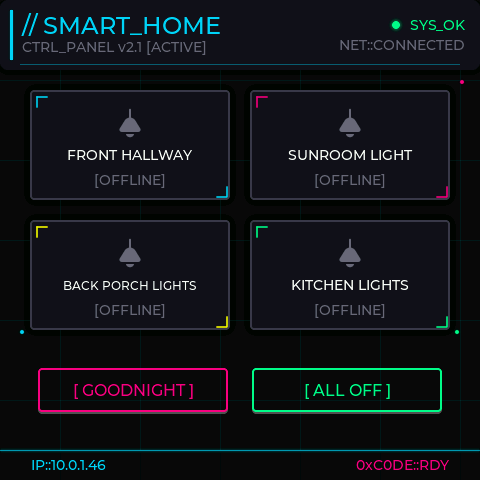

# ESP32 Display Manager

A smart home control panel built on the Guition ESP32-S3-4848S040 with a Bun/TypeScript management server and plugin system for external integrations like Homebridge.

### Dark Mode


### Cyberpunk Theme


### LCARS Theme


## Features

- **Multi-theme UI** - Dark, Light, Neon Cyberpunk, LCARS (Star Trek)
- **Plugin System** - Extensible architecture for smart home integrations
- **Homebridge Integration** - Control HomeKit devices via Homebridge API
- **Bi-directional Sync** - State changes from external apps reflected on display
- **Web Admin Dashboard** - Configure devices, buttons, and plugins from any browser
- **OTA Updates** - Update firmware over WiFi

## Architecture

```
┌─────────────────┐     ┌─────────────────────────────────────┐
│   ESP32 Panel   │◄───►│           Bun Server                │
│   (LVGL UI)     │     │  ┌─────────────────────────────┐    │
└─────────────────┘     │  │     Plugin Manager          │    │
                        │  │  ┌─────────────────────┐    │    │
                        │  │  │ Homebridge Plugin   │    │    │
                        │  │  └─────────────────────┘    │    │
                        │  └─────────────────────────────┘    │
                        │  ┌─────────────────────────────┐    │
                        │  │   State Sync Service        │    │
                        │  │   (polls plugins, pushes    │    │
                        │  │    states to ESP32)         │    │
                        │  └─────────────────────────────┘    │
                        └─────────────────────────────────────┘
```

## Hardware

**Guition ESP32-S3-4848S040**
- 480x480 IPS display (ST7701 controller)
- Capacitive touch (GT911)
- ESP32-S3 with 8MB PSRAM
- 16MB Flash

## Quick Start

### 1. Flash the ESP32

```bash
# Create secrets file
cp include/secrets.example.h include/secrets.h
# Edit with your WiFi credentials

# Build and flash
pio run -t upload
```

### 2. Start the Server

**Option A: Run locally with Bun**

```bash
cd server
bun install
bun run build
bun start
```

**Option B: Run with Docker Compose**

Create a `docker-compose.yml` file:

```yaml
services:
  esp32-display-server:
    image: ghcr.io/mccahan/esp32-display-panel-server:latest
    ports:
      - "3000:3000"
    volumes:
      - ./server-data:/app/data
    environment:
      - PORT=3000
      # Optional: Set reporting URL for devices behind reverse proxy/different port
      # - REPORTING_URL=http://your-server:8080
    restart: unless-stopped
```

Then run:

```bash
docker-compose up -d
```

### 3. Access the Dashboard

Open `http://localhost:3000` in your browser.

- **Discover** tab: Find and adopt ESP32 devices on your network
- **Devices** tab: Configure buttons, themes, and bindings
- **Plugins** tab: Enable and configure Homebridge integration

## Server

The Bun/TypeScript server (`server/`) provides:

- **Device Management** - Track, configure, and push updates to ESP32 panels
- **Plugin System** - Modular architecture for external integrations
- **State Sync** - Periodic polling of external systems with configurable intervals
- **Admin Dashboard** - Web UI for configuration
- **Deep-link URLs** - Direct links to devices/plugins (e.g., `#/device/{id}`, `#/plugins/homebridge`)

### API Endpoints

| Endpoint | Description |
|----------|-------------|
| `GET /api/devices` | List all adopted devices |
| `GET /api/devices/:id` | Get device details |
| `POST /api/devices/:id/config` | Push config to device |
| `GET /api/plugins` | List available plugins |
| `PUT /api/plugins/:id` | Configure a plugin |
| `GET /api/plugins/:id/devices` | Discover devices from plugin |

## Plugins

### Homebridge

Integrates with Homebridge to control HomeKit-compatible devices.

**Configuration:**
- Server URL (e.g., `https://homebridge.local`)
- Username
- Password

**Features:**
- Discovers lights, switches, fans, and outlets
- Bi-directional state sync (15-second polling interval)
- Fan speed control support

### Creating Plugins

Plugins implement the `Plugin` interface in `server/src/plugins/types.ts`:

```typescript
interface Plugin {
  id: string;
  name: string;
  type: 'device-provider' | 'action-handler' | 'http-action';
  pollingInterval?: number;  // Custom state polling interval (ms)

  initialize(config: PluginConfig): Promise<void>;
  shutdown(): Promise<void>;
  discoverDevices?(): Promise<ImportableDevice[]>;
  executeAction?(ctx: ActionContext): Promise<ActionResult>;
  getDeviceState?(externalDeviceId: string): Promise<DeviceState | null>;
}
```

## ESP32 Firmware

Built with PlatformIO and LVGL 8.x.

### Key Files

| File | Description |
|------|-------------|
| `src/main.cpp` | Entry point and setup |
| `src/ui_manager.cpp` | LVGL UI creation and theming |
| `src/device_controller.cpp` | Button actions and server communication |
| `src/web_server.cpp` | HTTP API endpoints |
| `src/config_manager.cpp` | Persistent configuration |

### ESP32 API Endpoints

| Endpoint | Description |
|----------|-------------|
| `GET /api/state` | Get current device state |
| `POST /api/state/buttons` | Receive button state updates |
| `POST /api/config` | Receive full configuration |
| `POST /api/screenshot/capture` | Capture display screenshot |
| `GET /api/screenshot/view` | Download screenshot |

## License

MIT

## See Also

- [DISPLAY-CLAUDE.md](DISPLAY-CLAUDE.md) - Detailed technical reference
- [LVGL Documentation](https://docs.lvgl.io/8.3/)
- [Homebridge API](https://github.com/homebridge/homebridge/wiki/Homebridge-API)
